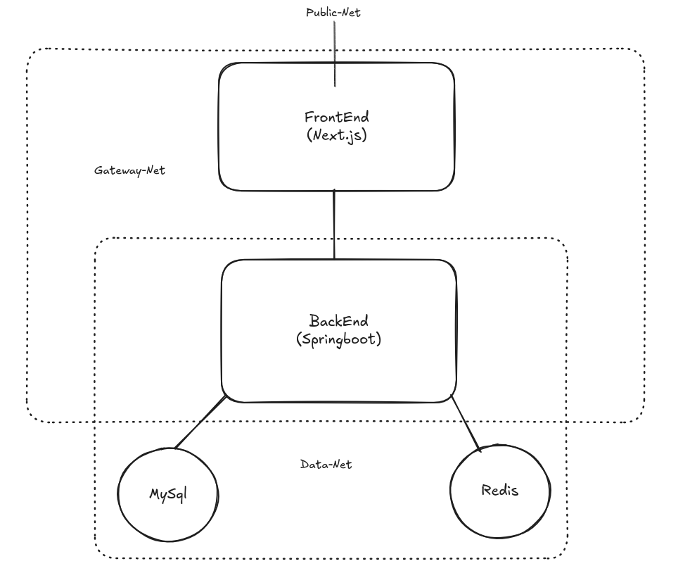

# Full-Stack Tech Content Platform

A complete web application with a **Spring Boot** backend API and a **Next.js** frontend, delivering dynamic technology-focused content — including articles, topics, and category-based sliders — with Redis caching, async processing, and pagination.

## Tech Stack

### Backend
- **Java 21** with Spring Boot
- **Spring Data JPA** & **Hibernate**
- **Spring Cache** with **Redis**
- **Spring Async** with custom thread pool
- **MySQL**
- **Maven** (presumed)
- **Validation** (Hibernate Validator)

### Frontend
- **Next.js** (App Router)
- **TypeScript**
- **Tailwind CSS**
- **Axios** or similar HTTP client

## Architecture Overview

## Backend Overview

The backend provides REST APIs optimized for a tech content platform.

### Key Features
- **Async Processing** – Custom thread pool (`coreSize=3, maxSize=10, queueCapacity=50`)
- **Redis Caching** – Default TTL 2 hours, with overrides for `user` (20 min) and `static` (5 hours)
- **JSON Serialization** – Human-readable cache via `GenericJackson2JsonRedisSerializer`
- **Pagination** – 12 items per page, with `hasNext` flag
- **Validation** – `@Positive`, `@Max`, `@Pattern` on all endpoints
- **Read-only Transactions** – Timeouts from 2–4 seconds

### Entity Model
- **`Topic`** – Title, description, image URL, first/second category, timestamps, soft delete
- **`Article`** – Head, body, image URL, section order (`sec`), linked to one `Topic`

### API Endpoints

| Controller | Endpoint | Description |
|------------|----------|-------------|
| **Article** | `GET /api/article/get/{topicID}` | Full article with topic metadata & ordered sections |
| **Slider** | `GET /api/slider/newest` | Latest 10 topics |
| | `GET /api/slider/system` | Operating system topics (firstCategory = "OperatingSystem") |
| | `GET /api/slider/language` | Programming language topics |
| | `GET /api/slider/job` | Job positions topics |
| | `GET /api/slider/ai` | AI topics |
| **Topic** | `GET /api/topic/by-topic/{name}?page=0` | Topics by first/second category (paginated) |
| | `GET /api/topic/search-topic/{name}?page=0` | Search in title + categories |
| | `GET /api/topic/newest?page=0` | Newest topics (paginated) |

> **Note:** The previous `TitleController` (newestTitles, goldTitles, aiTitles, etc.) has been removed. All title listings are now handled via the enhanced Slider and Topic APIs.

### Slider Limits
- All slider endpoints return **max 10 items**
- Ordered by `createdAt DESC`

### Pagination Details
- Page size: `12`
- Response format: `{ data: DataDto[], hasNext: boolean }`
- Max page number: `1000` (enforced in controller)

## Frontend Overview

The frontend is built with Next.js, TypeScript, and Tailwind CSS to match the updated backend APIs.